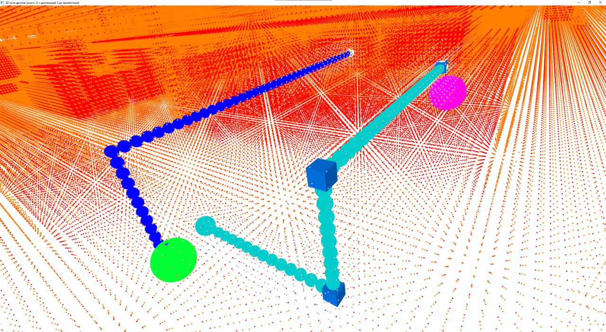
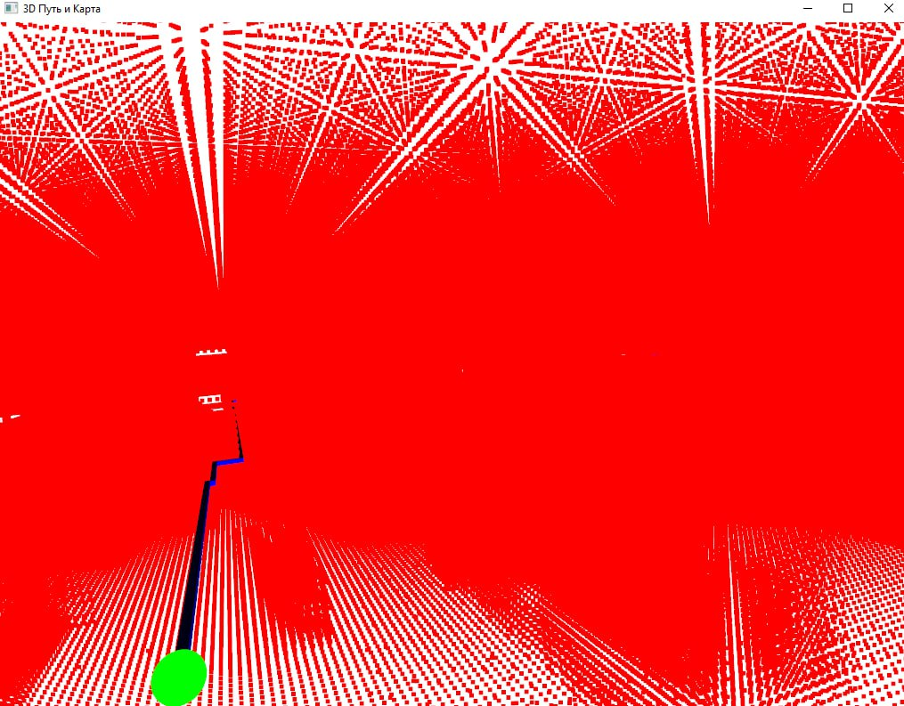
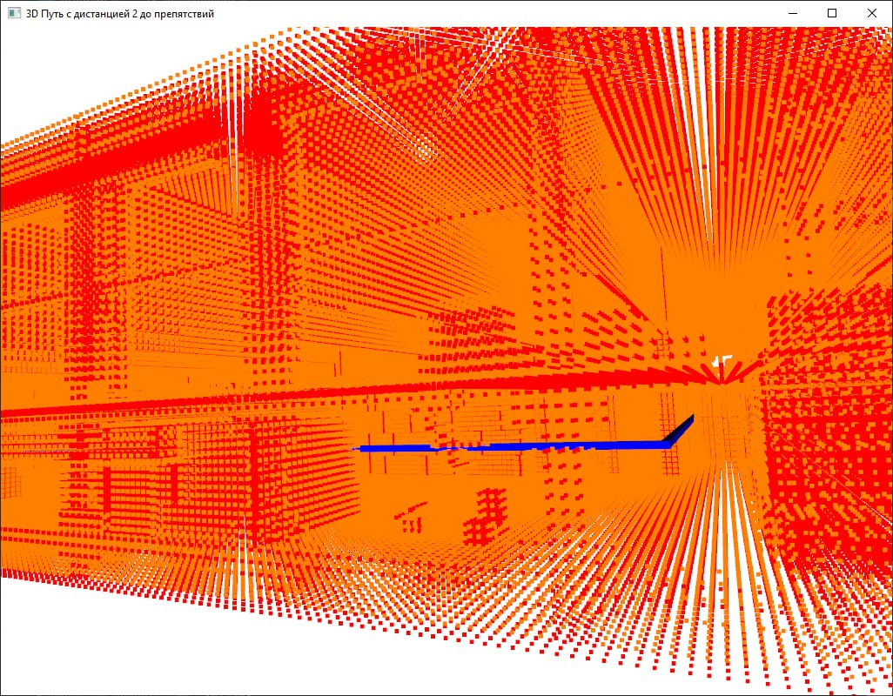

# SwarmIntelligenceHackathon (https://hackathon.1t.ru)
# ⭐ iT-Ti-Ty: Управление роем дронов для тушения пожаров

Проект в рамках хакатона от 1Т — кейс управление 5-ю дронами в симуляторе (https://game.1t.ru/AirSwarm.html)
для эффективного тушения очагов возгорания.
---

## 📁 Содержание

1. [📝 Описание и стек технологий](#-описание-и-стек-технологий)
2. [🔧 Структура проекта](#-структура-проекта)
3. [⚙️ Функционал](#-функционал)
4. [📦 Зависимости](#-зависимости)
5. [🚀 Использование](#-использование)
6. [🖼 Демо](#-демо)
7. [👥 Команда](#-команда)

---

## 📝 Описание и стек технологий

Проект представляет собой систему автономного управления роем из пяти дронов, действующих в 3D-симуляторе. Основная задача — эффективное обнаружение и тушение очагов возгорания. 

Этапы работы над проектом:

1. Картографирование локации симулятора.
2. Разбиение карты на сетку, апроксимация препятствий.
3. Проработка механизма управления дронами.
4. Составление маршрутов, стремящихся минимизировать количество поворотов или иных изменений направления полета, с целью увеличения средней скорости на маршруте.
5. Проработка проблемы столкновения дронов друг с другом, путем избегания коллизий маршрутов.
6. Тестирование работоспособности решения.
7. Постулучшения решения.

### Технологии, использованные в проекте:

- **Python** — язык программирования, используемый в данном проекте
- **FastAPI** — легкий и быстрый REST API для взаимодействия с симулятором
- **A\*** — алгоритм поиска кратчайшего пути с учетом препятствий, модифицированный
- **Octomap** — создание и обновление объемной карты (3D occupancy grid)
- **Open3D** — построение и визуализация трехмерной среды

---

## 🔧 Структура проекта

```
program/
├── algorithm/          
|             ├── fly_main.py    # основной алгоритм управления
|             ├── flyrandom.py   # ручное управление
├── connections/        # файлы подключения
|             ├── __init__.py
|             ├── Connection.py 
|             ├── SocketConnection.py
├── grid/               
|       ├── occupancy_grid.npy    # сетка с препятствиями
|       ├── occupancy_grid_distance_map_md8.npy   # дистанции до препятствий
├── points_cloud/
├── services/           
|       ├── __init__.py
|       ├── logger.py
├── config.py           
├── main.py             # основной файл
├── pathfinder.py       # поиск путей
├── pathfinder_v.py     # вспомогательный файл, визуализатор путей
├── requirements.txt    # файл зависимостей
├── start.bat           # кнопка запуска проекта
└── README.md
```

---

## ⚙️ Функционал 

- Визуализация сетки с целью отладки
- Прокладывание эффективного маршрута для каждого дрона
- Использование механизмов управления дроном на основе PID контроллеров
- Применение алгоритма для устранения возможных коллизий маршрутов
- Распределение маршрутов между дронами
- Осуществление перемещения дрона в заданную точку
- Тушение очага возгорания и возвращение на базу для перезарядки
- Успешное устранение очагов возгорания

---

## 📦 Зависимости

Все зависимости перечислены в файле requirements.txt 

### Установка с помощью `requirements.txt`:

```bash
pip install -r requirements.txt
```

---

## 🚀 Использование

1. Клонировать репозиторий:

```bash
git clone https://gitlab.data.1t.ru/data-hack/SwarmIntelligenceHackathon25-1170
```
```bash
cd <название_папки>
```

2. Запустить симулятор
3. Запустить основной файл проекта, либо запустить файл start.bat

```bash
python main.py
```
```bash
start.bat
```

4. Переподключите симулятор (кнопка в самом симуляторе).

ВАЖНО!!! У нас когда запускали через PyCharm время увеличивалось на минуту.

---

## 🖼 Демо

Гифка работы программы:







## 👥 Команда

Команда **iT-Ti-Ty**:

- Милькевич Алексей, ТГ — @limonskislinkoy
- Югай Константин
- Силантьев Валерий


